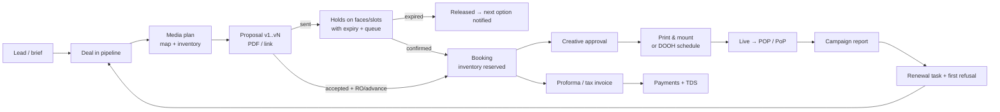

# Reklama Global CRM: Product & Build Plan

**Version:** 1.0 · 2026-09-25
**Source:** `Reklama_Global_CRM_Requirements.pdf` (19 sections)

This plan keeps every requirement in the spec. It adds features for how outdoor (OOH) and digital out-of-home (DOOH) media is sold, run and billed in India. Each added feature is tagged with the phase it ships in:

- **[P1]** Core CRM (usable end to end)
- **[P2]** Operations & finance
- **[P3]** Integrations & growth
- **[Future]** Only if the business needs it

---

## Decisions log

| Date | Decision | Effect on this plan |
|---|---|---|
| 2026-09-25 | **Each asset is one whole screen.** No multi-face structures. | The structure → face model is dropped. The asset itself is the bookable unit. |
| 2026-09-25 | **LED screens are sold both as slots and exclusively.** Reklama hasn't settled on one model. | Each LED screen has a slot capacity. An exclusive booking takes every slot; a slot booking takes N slots. A hoarding has a capacity of 1. |
| 2026-09-25 | **Map-based planning is deferred.** | Map view, radius search and Street View links are out of the prototype. Inventory is filtered by city, area and type instead. |
| 2026-09-25 | **Build a working prototype** of everything else for the Reklama demo, with a **very simple, intuitive UI**. | Build order follows §9, favouring guided flows and few visible fields. |
| 2026-09-25 | **Prototype hosting: Vercel + Turso (SQLite).** This is for the prototype only; production will be scaled up. | The data layer uses Drizzle on SQLite/libSQL. §6 describes the production target; the scale-up plan is in `PRODUCTION_READINESS.md` §3. |

---

## Contents

1. [Summary](#1-summary)
2. [How the business works (glossary)](#2-how-the-business-works-glossary)
3. [Users & roles](#3-users--roles)
4. [Feature plan by module](#4-feature-plan-by-module)
5. [End-to-end flow](#5-end-to-end-flow)
6. [Architecture & stack](#6-architecture--stack)
7. [Data model](#7-data-model)
8. [Roles & permissions](#8-roles--permissions)
9. [Delivery roadmap](#9-delivery-roadmap)
10. [Acceptance checklist](#10-acceptance-checklist)
11. [Open questions](#11-open-questions)
12. [Risks & mitigations](#12-risks--mitigations)

---

## 1. Summary

Reklama sells time and space on hoardings and LED screens. The CRM must:

- keep **one record per client** with every interaction;
- know exactly which inventory is **free, held or sold** on any date;
- turn a client brief into a proposal, then a booking, then a live campaign with proof, then an invoice, **without re-typing anything**;
- show the owner who is doing what, and what each site earns.

**The biggest improvements over the spec:**

| # | Addition | Why it matters in OOH/DOOH |
|---|---|---|
| 1 | **Holds / options** with expiry and a queue | The industry's standard way to reserve a site while a client decides. The spec only has confirmed bookings. |
| 2 | **DOOH sold as slots** (share of voice) | LED screens carry several advertisers in one loop. The spec treats them like hoardings. |
| 3 | **Agencies & Release Orders (RO)** | Much OOH is bought through media agencies, which take a commission and issue ROs. |
| 4 | **Site photos** (map planning deferred, see Decisions log) | This is how clients actually choose sites. |
| 5 | ~~Structure → face~~ **One screen = one bookable unit** | Confirmed by Reklama (see Decisions log). |
| 6 | **Field app with geo-verified proof** | Proof-of-posting photos that clients trust, taken by crews on site. |
| 7 | **Site economics** | Lease rent, escalations, permits and electricity feed a per-site P&L and occupancy figure. |
| 8 | **India finance specifics** | GST, TDS deducted by clients, proforma invoices, e-invoicing, Tally. |

---

## 2. How the business works (glossary)

| Term | Meaning | Why the CRM cares |
|---|---|---|
| **Hoarding / billboard** (static) | Printed flex or vinyl on a structure | Booked exclusively for a period. Needs printing and mounting. |
| **Face** | One sellable side of a structure | This is the unit that gets booked, not the structure. |
| **DOOH / LED screen** | Digital screen that plays a loop of ads | Sold by slots, so many advertisers run at once. |
| **Loop / slot / SOV** | Example: a 180-second loop split into 12 × 15-second slots. One slot is a 1/12 share of voice (SOV). | Screen capacity = slots per loop. |
| **Frontlit / backlit / non-lit** | How the hoarding is lit | Affects price, night visibility and electricity cost. |
| **Hold / option** | Provisional reservation with an expiry. Holds queue up as 1st, 2nd and 3rd option. | Stops a site being lost while the client decides. |
| **Release Order (RO)** | The agency's or client's purchase order for media | The formal basis for booking and invoicing. |
| **POP / PoP** | Proof of Posting (photos of a static site) / Proof of Play (play logs from a DOOH screen) | Clients expect it before they pay. |
| **Make-good** | Compensation (extra days or spots) for downtime | Affects billing and credit notes. |
| **Mounting / dismounting** | Installing or removing flex on site | Operations work orders. |
| **Rate card** | Published price per face per month (or per slot) | The base for discounts and approvals. |
| **Agency commission** | Typically 15% to accredited agencies | Affects pricing and invoices. |
| **CPM** | Cost per 1,000 impressions | How agencies compare sites and plans. |

---

## 3. Users & roles

**Roles from the spec:** Owner/Admin, Sales Manager, Sales Executive, Operations, Accounts.

**Added roles:**

- **Field Crew [P2]**: uses a phone only. Sees the work orders assigned to them and uploads geo-tagged photos.
- **Client / Agency portal user [P3]**: an external login that sees only its own campaigns, proofs and invoices.

Site acquisition and lease work sits under Operations as a permission, not a separate role. See §8 for the full permission matrix.

---

## 4. Feature plan by module

Each module lists the spec baseline in one line, followed by the additions.

### 4.1 Leads & pipeline

**Spec:**
- Lead fields
- CSV/Excel import with duplicate detection
- Filters
- Configurable pipeline (New → Contacted → Qualified → Meeting → Proposal → Negotiation → Won/Lost)
- Lost reasons
- Manual or rule-based assignment
- Views of unassigned and inactive leads
- Funnel reports

**Additions:**

- **[P1] Industry verticals preset:**
  - Covers real estate, education, retail, jewellery, FMCG, BFSI, auto, healthcare, film/entertainment, political and government.
  - Used for filtering, reports and seasonality.
- **[P1] Lead scoring:**
  - Budget
  - How well the vertical fits
  - Whether the preferred locations match available inventory
  - How recent the last activity was
- **[P1] Assignment rules** by territory (city/zone), by vertical, or round-robin.
- **[P2] Competitive intelligence:**
  - Field staff photograph brands running on competitors' sites. Each photo creates a lead with brand, location, photo and date.
  - This is a standard way OOH sales teams find prospects.
- **[P2] Trigger-based prospecting:**
  - Tags for events such as a new store opening, a real-estate launch, a film release or admission season.
  - Each tag carries an auto follow-up date.
- **[P3] Automated lead sourcing** (spec §3):
  - Only with a named data provider.
  - Coverage, accuracy, permitted use and cost must be documented.

### 4.2 Clients, agencies & contacts

**Spec:** one central client record, with contacts and a client status.

**Additions:**

- **[P1] Account types:** Direct advertiser (brand), Media agency, Government/PSU.
  - An agency is linked to the brands it buys for.
  - Every campaign records both the **advertiser** and the **billing party**.
- **[P1] Agency commission:** a default % per agency, applied automatically on quotes and invoices.
- **[P1] Billing profile** per account:
  - Legal name
  - GSTIN (format and state code checked)
  - PAN
  - Billing address
  - Place of supply
  - Credit terms (days)
  - Credit limit
- **[P1] Duplicate detection** on GSTIN, phone, email and fuzzy company name.
- **[P2] Client health:**
  - Lifetime value, last booking date, repeat rate and average payment delay.
  - Dormant clients (no booking in N months) get a reactivation task.

### 4.3 Activity timeline & communications

**Spec:**
- One timeline per client covering calls, WhatsApp, email, meetings, notes, quotes, bookings, invoices and payments
- Interaction count and last-contacted date
- Timeline filters
- Team visibility
- Click-to-call, WhatsApp and email integrations with templates

**Plan:**

- **[P1] One `activities` table:**
  - Manual logging, with a required outcome.
  - `tel:`, `wa.me` and `mailto:` quick-action buttons open the channel and **auto-log an activity**.
  - This is an honest stop-gap until the real integrations arrive, not a claim that the channels are "integrated".
- **[P1] Outbound email** (provider or company SMTP) to send proposals and invoices. Each send is logged with its attachment and version.
- **[P1] System events** posted to the timeline automatically: quote sent, hold placed or expired, booking confirmed, invoice raised, payment received, POP uploaded.
- **[P3] WhatsApp Business API** through a provider (Interakt, Gupshup, WATI, AiSensy, or Meta Cloud API directly):
  - Approved templates
  - Sending PDFs
  - Capturing replies
  - Tracking opt-in
- **[P3] Telephony** (Exotel, MyOperator, Knowlarity, Ozonetel):
  - Click-to-call through a virtual number
  - Inbound and outbound call logs
  - Call recordings
  - Automatic matching of phone number to client
- **[P3] Two-way email sync** with Google Workspace or Microsoft 365 (OAuth). Threads are linked to clients by contact email.
- **[P3] Call recordings** transcribed and summarised by AI.

### 4.4 Tasks & reminders

**Spec:**
- Reminders created after activities
- Date, time, priority, owner and reminder method
- Daily views of due, upcoming, completed and overdue tasks
- Missed-follow-up alerts
- Task suggestions after a quote is sent or a contract nears expiry
- Outcome required on completion
- Manager view

**Additions:**

- **[P1] Automatic tasks triggered by events:**

  | Event | Task |
  |---|---|
  | Quote sent | Follow up in N days |
  | Hold expiring within 24 hours | Call the client |
  | Campaign ending in 30 / 15 / 7 days | Renewal |
  | Invoice due | Collection call |
  | Permit expiring within 60 days | Operations task |
  | Creative not received by its due date | Chase the client |

- **[P1] Stale-lead rule:** a qualified lead with no activity for X days alerts the Sales Manager and the Owner.
- **[P1] Notifications:**
  - In-app alerts.
  - A daily 9 am email agenda for each user.
  - **[P2]** Web push through the installed phone app (PWA).
  - **[P3]** WhatsApp.

### 4.5 Inventory (static + DOOH)

**Spec:**
- Asset ID, type, address, area, map link and landmarks
- Dimensions, resolution, media and visibility
- Rate card, pricing rules, operating costs and site owner
- Availability and maintenance status, booking calendar and history
- Contracts and permits
- Filters and Excel import
- No double booking

**Additions:**

- **[P1] Structure → face model.** One structure (for example, a two-sided unipole) has several faces, and each face is booked separately.
- **[P1] Attributes by asset type:**

  | Asset type | Fields |
  |---|---|
  | **Static** | Width × height (ft), sq ft, illumination (frontlit/backlit/non-lit), material, facing direction, height from ground |
  | **DOOH** | Width × height, pixel resolution, pixel pitch, aspect ratio, operating hours, loop length, slot length, **slots per loop (capacity)**, supported file formats, maximum file size, audio (yes/no) |
  | **Common** | GPS latitude/longitude, city/zone/locality, road, traffic direction, nearby points of interest, visibility distance, dwell time, **daily traffic / impression estimate** |

- **[P1] Ownership type:**
  - **Owned**
  - **Leased** from a landlord
  - **Third-party**: another media owner's site that Reklama resells. The buy cost and vendor are recorded so margin can be tracked.
- **[P1] Photo library:**
  - Day and night photos, each dated.
  - A warning appears when the newest photo is more than 90 days old.
- **[P1] Map view** (Leaflet + OpenStreetMap):
  - Pins clustered and coloured by availability for the selected dates.
  - Search by radius or by drawing an area.
  - A Google Street View link for each site.
- **[P1] Availability view:** a Gantt chart with one row per face or screen and one column per day. Holds and confirmed bookings are shown differently, and DOOH rows show slots sold out of capacity.
- **[P2] Occupancy & yield:**
  - Occupancy % by asset and month.
  - Forecast of unsold inventory for the next 30, 60 and 90 days.
  - Realised rate vs rate card.
- **[P3] Site acquisition pipeline:**
  - Stages: scouted → landlord negotiation → permit applied → approved → construction → live.
  - Records capex and expected yield.

### 4.6 Media planning & proposals

**Spec:**
- Pick screens from the client profile
- Screen-level pricing, monthly and campaign rates, packages
- Multiple options per proposal
- Discounts, GST, validity and T&C
- Approval above the discount limit
- Branded PDF, sent by email or WhatsApp
- Statuses: draft, sent, revised, accepted, rejected, expired
- Version history
- Convert to booking

**Additions:**

- **[P1] Brief capture:**
  - Target cities or areas, audience, budget, dates, formats and objective.
  - Saved on the deal and used to pre-filter inventory.
- **[P1] Plan builder:**
  - Add faces or screens from the map or a list.
  - Live totals: cost, total sq ft, estimated impressions, **CPM** and average cost per day.
- **[P1] Rate cards:**
  - Base monthly rate
  - **Minimum booking period**
  - **Floor price** (going below it needs approval)
  - **Seasonal surcharge calendar** (festivals, IPL, elections)
  - Pro-rata for part months
  - DOOH price per slot per day or week
- **[P1] Production costs as line items:**
  - Printing (per sq ft, by material), mounting, dismounting and creative design.
  - Each can be marked "included" or "extra".
- **[P1] Agency commission and GST lines** calculated automatically.
- **[P1] Proposal PDF** with each site's photo, a map thumbnail, specs, dates and price. OOH clients expect this, not a bare price table.
- **[P1] Excel export of the plan** (agencies often ask for Excel).
- **[P2] Creative mockup:**
  - Overlays the client's artwork onto the site photo.
  - Uses four corner points stored once per photo to get the perspective right.
- **[P3] Shareable proposal link:**
  - An interactive map with photos.
  - The client picks an option and accepts online.
  - Views (opened, time spent) are logged to the timeline.
- **[P3] AI plan suggestions:** given a budget, area and dates, suggest the combination of sites with the most reach within budget.

### 4.7 Holds, bookings & availability

**Spec:**
- Convert an accepted quote into a booking and reserve the inventory
- No double booking
- Record the PO, payment terms, advance and campaign owner
- Extensions, renewals and cancellations

**Additions:**

- **[P1] Holds / options:**
  - Holds are placed on faces for the proposal dates when it is sent.
  - Each hold has an expiry (configurable, default 48–72 hours).
  - Holds queue as 1st, 2nd and 3rd option.
  - When a hold expires it is released automatically and the next in line is notified.
  - A manager can extend a hold.
- **[P1] Release Order capture:**
  - RO number, date, uploaded document and amount.
  - A booking is confirmed only when there is an RO or an advance payment (configurable rule).
- **[P1] DOOH slot booking:**
  - Book N slots on a screen for a date range.
  - Capacity is enforced per day, and the share of voice is shown.
- **[P1] Booking changes:**
  - Extend, shorten, swap a site (needs approval), or cancel under the cancellation-charge policy.
  - Every change is versioned and audited.
- **[P2] Renewal engine:**
  - When a campaign is ending, a renewal quote is pre-filled with the same sites and the next dates.
  - The current advertiser gets **right of first refusal**: a hold for N days before the site opens to others.

### 4.8 Creative management [P2]

- Creative uploads per campaign, with versions and a client/agency approval status.
- **Spec check on upload:**
  - **DOOH:** resolution, aspect ratio, duration, file type and size.
  - **Static:** print-file dimensions and DPI compared with the site size.
- **Content compliance checklist:**
  - Flags restricted categories: alcohol or tobacco surrogates, political ads, and sites near schools or hospitals.
  - Follows ASCI guidelines.
  - Anything flagged needs manager approval.
- **Deadline tracking:**
  - Creative due date = campaign start − print and mounting lead time.
  - An alert fires when the creative is late.

### 4.9 Campaign execution: static

- **[P1] Campaign status:** creative received → approved → printed → mounted → live → dismounted → completed. POP photos can be uploaded.
- **[P2] Work orders:**
  - **Printing job** to a printer vendor: material, size, quantity, cost and due date.
  - **Mounting job** to a crew: site, date and flex reference.
  - **Dismounting job** at campaign end.
- **[P2] Field app** (PWA, installed on the crew's phone):
  - The crew's job list, with navigation to each site.
  - Photos are stamped with **GPS position and time**.
  - An upload is **rejected if taken more than X metres from the site**.
  - An offline queue for areas with poor signal.
- **[P2] Monitoring:** scheduled mid-campaign and night photos for long campaigns.
- **[P2] Automatic POP report:**
  - A branded PDF per campaign with day and night photos for each site, stamped with date, time and GPS, plus the campaign dates.
  - Shared with the client and linked to the invoice.

### 4.10 Campaign execution: DOOH

- **[P2] Playlist and schedule:**
  - Slots per screen per day, dayparting, start and end dates.
  - Export the schedule for whoever runs the screen's content-management system (CMS).
- **[P2] Proof-of-play import:**
  - Upload play logs (CSV from the CMS or LED controller) and match them to bookings.
  - Compare delivered plays with contracted plays. Under-delivery triggers a make-good.
- **[P3] CMS integration:**
  - Depends on the hardware in use: Novastar VNNOX, Colorlight, Xibo, Broadsign and others.
  - Push creatives and schedules, and pull play logs automatically.
- **[P3] Screen health:** uptime monitored through the controller or CMS, with downtime logged against affected bookings.

### 4.11 Maintenance, downtime & make-goods [P2]

- **Tickets per asset:**
  - Types: torn flex, lighting failure, LED dead pixels or screen offline, structural damage, obstruction (such as tree growth).
  - Each has priority, assignee, SLA, before and after photos, and cost.
- **Downtime:**
  - Downtime periods are recorded, and bookings that overlap them are flagged.
  - Make-good options: extra days, extra slots, or a credit note (needs approval).
- **Planned maintenance** blocks availability on the calendar.

### 4.12 Billing, GST, TDS & collections

**Spec:**
- Invoice from a booking or quote
- Sequential numbering
- GST and invoice PDF
- Advance, partial, final and recurring payments
- Payment mode and reference, receipts
- Outstanding balance and due date
- Payment reminders and overdue reports
- Credit notes with approval
- Accounting export

**Additions:**

- **[P1] Numbering by financial year, with no gaps:**
  - Separate series for tax invoices, proformas, credit notes and receipts (e.g. `RG/2026-27/0001`).
  - The number is assigned **only when the invoice is finalised**, so drafts never use up numbers.
- **[P1] Proforma invoice** to collect the advance before a campaign starts (common in OOH).
- **[P1] GST:**
  - SAC code on every line (e.g. 998366; confirm with the CA).
  - 18% rate.
  - CGST+SGST or IGST depending on place of supply.
  - GSTIN printed on the invoice.
  - Correct back-calculation when a price includes tax.
- **[P1] TDS on receipts:**
  - Clients usually deduct TDS (commonly under 194C).
  - Record the gross amount, TDS deducted and net received.
  - An invoice is settled when net + TDS = total.
  - Track receipt of TDS certificates each quarter.
- **[P1] Aging:**
  - Buckets of 0–30, 31–60, 61–90 and 90+ days, by client and by executive.
  - A **credit-limit warning** (or block, configurable) when booking for a client who is over their limit or overdue.
- **[P2] Billing schedules:** monthly invoices for long campaigns, pro-rata periods and advance adjustments.
- **[P2] Credit and debit notes** linked to make-goods and cancellations.
- **[P2] Payment links** (Razorpay/UPI) on invoice PDFs and reminders. Payments are matched to invoices automatically through a webhook.
- **[P2] Accounting:** Tally Prime XML export (vouchers and ledgers) or Zoho Books API sync.
- **[P2] E-invoicing (IRN + QR)** through a GST Suvidha Provider (GSP), if Reklama's turnover is above the mandatory threshold (currently ₹5 crore).
- **[P2] Collection cadence:**
  - Automatic reminders 3 days before the due date, on it, and 7 and 15 days after it.
  - Sent by email (WhatsApp in P3).
  - Escalates to the manager if still unpaid.

### 4.13 Site owners, leases & compliance

**Spec:**
- Site-owner contacts and their assets
- Rental and operating costs
- Contract dates and renewal reminders
- Documents
- Vendor invoices and payment status
- Maintenance costs
- Asset-wise revenue and cost

**Additions:**

- **[P2] Lease terms:**
  - Rent amount, frequency and due day.
  - **Escalation** (% every N years).
  - Security deposit, lock-in and notice period.
  - A rent-payable schedule is generated automatically.
- **[P2] TDS on rent payments:** rate configurable (confirm the section with the CA), and landlord PAN recorded.
- **[P2] Municipal compliance:**
  - Issuing authority, licence number and validity.
  - Advertisement tax and fee payments.
  - **Structural stability certificate** and insurance policy.
  - Expiry alerts at 90, 60 and 30 days.
  - An expired permit flags the asset as "at risk", and sales staff are warned before selling it.
- **[P2] Electricity:** meter number and monthly bills for lit and LED sites.
- **[P2] Third-party media purchases:** buy orders to other media owners for resold sites, with margin tracking.
- **[P2] Asset P&L:**
  - Revenue (invoice lines allocated by period) minus rent, electricity, permit fees and taxes, maintenance and third-party cost.
  - Gives margin per asset per month, and occupancy compared with break-even.

### 4.14 Sales targets & incentives [P2]

- Monthly and quarterly targets per executive and per team: booked value, collected value and new clients.
- Achievement dashboards and a leaderboard.
- Incentives calculated on **collected** revenue by default (configurable).

### 4.15 Dashboards & reports

**Spec:**
- Reports: daily activity, funnel, sales, client, inventory, finance, campaigns and profitability
- Filters
- Excel/PDF export

**Additions:**

- **[P1] Owner home screen:**
  - Today's collections
  - Overdue follow-ups by executive
  - Holds expiring
  - Campaigns going live or ending this week
  - This month's occupancy
  - Total outstanding
- **[P1] Executive home screen:** my tasks today, my holds, my pipeline and my outstanding collections.
- **[P2] Analytics:**
  - Occupancy heatmap (assets × months)
  - Unsold-inventory forecast
  - Rate realisation
  - Discount leakage by executive
  - Win rate by vertical and source
  - Average days to close
  - Days sales outstanding (DSO)
  - Asset P&L ranking
  - Top clients and agencies
- **[P2] Scheduled reports** by email, such as a weekly summary for the owner.

### 4.16 Client & agency portal [P3]

- A login for client and agency contacts, showing:
  - Active and past campaigns
  - POP reports and photos, and proof-of-play logs
  - Invoices and payment status
- From the portal they can:
  - Pay online
  - Approve creatives
  - Download proposals
  - Request a new plan
- **Vacancy feed** for agencies: sites available in the next 30 or 60 days.

### 4.17 Platform capabilities

**Spec:**
- Global search
- Document storage
- Templates and notifications
- Renewal and expiry reminders
- Duplicate detection
- Mobile-friendly screens
- Secure login, backups and audit logs
- Data export and a documented exit process

**Additions:**

- **[P1] Fuzzy global search** across client, contact phone, GSTIN, asset ID, quote number, invoice number and RO number.
- **[P1] Audit log:** who changed what and when, with before and after values, on key tables (captured by database triggers).
- **[P1] Configurable lists and settings:**
  - Cities and zones, verticals, lost reasons, pipeline stages
  - T&C templates, tax rates, numbering series
  - Discount limits by role
- **[P1] Data export and backups:**
  - Full export: CSV or Excel per entity, plus a ZIP of all files.
  - Daily backups, with a restore that has actually been tested.
- **[P1] Security:** two-factor login for Owner and Accounts, session management and a device/IP log.
- **[P2] Installable phone app (PWA)** with web push.
- **[P3] Vacancy broadcast:** one click sends an "available this month" catalogue (PDF or image cards) to the agency list by WhatsApp or email.
- **[P3] AI assist:**
  - Client timeline summaries
  - Draft follow-up messages
  - Reading RO/PO documents to pre-fill a booking
  - Report questions asked in plain language
- **[Future] Programmatic DOOH:**
  - Offer screens to automated ad exchanges (SSPs such as Vistar, Hivestack or VIOOH).
  - Only worth it if the LED network grows large enough.
- **[Future] Multiple cities, branches or companies:** needed if Reklama has more than one legal entity or GSTIN.

---

## 5. End-to-end flow



---

## 6. Architecture & stack

| Layer | Choice | Why |
|---|---|---|
| App | **Next.js (App Router) + TypeScript** | One codebase for the UI and the API. Works on desktop and phone. |
| Database | **PostgreSQL** + `postgis`, `pg_trgm`, `btree_gist` | Geo search, fuzzy duplicate detection, and constraints that block double bookings in the database itself. |
| ORM | **Drizzle** | Typed queries, and raw SQL is easy when needed for constraints and triggers. |
| Backend platform | **InsForge** or **Supabase** (auth, storage, scheduled functions) | Check that PostGIS is available on the chosen host (Supabase has it). |
| UI | Tailwind + shadcn/ui, TanStack Table, Leaflet + OSM tiles, Gantt-style availability grid | Fast to build, and map tiles are free. |
| Files | Object storage, `sharp` for resizing, EXIF reading | Photo-heavy business, so storage cost has to be controlled. |
| PDFs | `@react-pdf/renderer` | Proposals, invoices and POP reports from shared templates. |
| Excel | `exceljs` | Inventory and lead imports, and exports. |
| Background jobs | Scheduled functions / cron | Hold expiry, reminders, daily digests, aging, permit and lease alerts. |
| Email | Transactional email provider or company SMTP | Sending proposals and invoices. |
| Field app | PWA in the same codebase, offline queue in IndexedDB, Geolocation API | No app-store release needed. |
| Hosting | Vercel (app) + managed Postgres, in an India region if available | Separate staging and production environments. |
| Monitoring | Sentry + an uptime monitor | Catches errors and outages early. |

**Tenancy:** built for a single company (Reklama) unless it will be sold as a product to other OOH companies. That decision must be made before M0 (see §11, question 11).

---

## 7. Data model

### Entities

| Area | Tables |
|---|---|
| **Identity** | `users`, `roles`, `permissions`, `teams`, `territories` |
| **CRM** | `accounts` (advertiser / agency / govt), `account_links` (agency ↔ advertiser), `contacts`, `billing_profiles`, `deals`, `deal_briefs`, `activities`, `tasks`, `notifications` |
| **Inventory** | `structures`, `faces` (static or DOOH), `asset_media` (day/night, corner points), `rate_cards`, `rate_rules` (seasonal, min period, floor), `site_owners`, `leases`, `permits`, `utilities`, `maintenance_tickets`, `downtime` |
| **Sales** | `proposals`, `proposal_versions` (immutable), `proposal_options`, `proposal_lines` (face, dates, slots, rate, discount, production items), `approvals` |
| **Reservations** | `allocations` (face, period, kind = hold/confirmed, status, rank, expires_at, slots, booking or proposal version), `dooh_day_capacity` (face, day, capacity, sold) |
| **Campaigns** | `bookings`, `booking_changes`, `release_orders`, `creatives`, `creative_versions`, `work_orders`, `pop_photos`, `play_logs`, `make_goods` |
| **Finance** | `number_series`, `invoices` (proforma / tax), `invoice_lines`, `payments`, `payment_allocations`, `tds_entries`, `credit_notes`, `vendor_bills`, `expenses` |
| **Targets** | `targets`, `incentive_rules` |
| **System** | `documents`, `audit_log`, `settings` |

### Rules enforced by the database

- **No double booking of static faces:**
  ```sql
  EXCLUDE USING gist (face_id WITH =, period WITH &&)
    WHERE (kind = 'confirmed' AND status = 'active')
  ```
- **DOOH capacity:**
  - One row per screen per day with `CHECK (slots_sold <= slots_capacity)`.
  - The row is updated in the same transaction as the allocation, so two sales cannot oversell a screen.
- **Invoice numbers:**
  - The `number_series(series, fy, next_no)` row is locked with `SELECT … FOR UPDATE` when an invoice is finalised.
  - `UNIQUE (series, fy, number)`.
- **Immutability:**
  - Proposal versions and finalised invoices cannot be updated (blocked by a trigger).
  - A change means a new version or a credit note.
- **Money** is stored as integer paise (`bigint`), never as floats.
- **Dates:** timestamps in UTC. Business dates are `date` or `daterange`, interpreted in IST.
- **Deletion:** soft delete plus an audit trail on all key tables.

---

## 8. Roles & permissions

**Key:**
- **V** view · **E** edit · **A** approve · **X** export
- **own** = records assigned to the user
- **team** = records of the manager's team
- Deletion is Owner-only and always a soft delete.

| Module | Owner | Sales Mgr | Sales Exec | Ops | Accounts | Field Crew | Portal |
|---|---|---|---|---|---|---|---|
| Leads / accounts | V E A X | team V E X | own V E ¹ | V | V | – | – |
| Activities / tasks | all | team V E | own V E | own V E | own V E | own V E | – |
| Inventory & availability | all | V | V | V E | V | assigned V | vacancy feed |
| Rate cards & discount limits | V E A | V | V | – | V | – | – |
| Proposals | all | team V E A ² | own V E | V | V | – | own V A |
| Holds & bookings | all | team V E A | own V E | V E | V | – | own V |
| Creatives & execution | all | V | own V | V E A | – | assigned E | own V A |
| Invoices & payments | all | V | own V | – | V E A X | – | own V + pay |
| Leases, permits & costs | all | – | – | V E | V E | – | – |
| Reports | all | team | own | operations | finance | – | – |
| Users & settings | all | – | – | – | – | – | – |

¹ Whether executives can see other executives' clients is open question 2 in §11.
² Up to the manager's own discount limit. Anything above it goes to the Owner.

---

## 9. Delivery roadmap

### Phase 1: Core CRM, usable end to end

Phase 1 includes the spec's Phase 1 plus only the additions that **shape the data model**: faces, DOOH slots, holds, agencies/RO, GST/TDS. Adding those later would mean a rewrite.

| # | Milestone | Scope |
|---|---|---|
| M0 | Foundation | Repo, CI, staging, auth + two-factor login, roles/permissions, audit triggers, settings screens, app shell |
| M1 | Accounts & leads | Advertiser/agency accounts, contacts, billing profiles/GSTIN, import + duplicate detection, pipeline board, assignment rules, activities + timeline, quick actions |
| M2 | Tasks & notifications | Tasks, automatic tasks from events, daily agenda, overdue/stale alerts, email digest, owner and executive home screens |
| M3 | Inventory & map | Structures/faces, static + DOOH attributes, import of the current Excel sheet, photo library, map view, availability Gantt |
| M4 | Planning & proposals | Briefs, plan builder with CPM, rate cards/rules, production items, agency commission, GST, discount approvals, versions, branded PDF with photos, email sending |
| M5 | Holds & bookings | Holds with expiry and queue, RO capture, confirmation → allocation (DB constraints), DOOH slots, booking changes, basic campaign status + POP upload |
| M6 | Billing | Numbering by FY, proforma + tax invoices, GST split, payments with TDS, receipts, aging, credit-limit warnings |
| M7 | Reports & launch | Core reports + exports, global search, backup/restore drill, data migration, UAT against §10, training |

### Phase 2: Operations & finance

- **Creative:** creative management and spec checks, creative mockups.
- **Static execution:** work orders, field app with geo-verified POP, automatic POP reports.
- **DOOH execution:** schedule export, proof-of-play log import.
- **Maintenance:** tickets, downtime and make-goods.
- **Sites:** leases, permits and utilities, asset P&L.
- **Billing:** billing schedules, credit notes, payment links, Tally/Zoho, e-invoicing if required.
- **Sales:** renewal engine with first refusal, targets and incentives, competitive-intelligence capture.
- **Analytics:** occupancy, yield, DSO and the other reports in §4.15.

### Phase 3: Integrations & growth

- **Channels:** WhatsApp Business API, telephony, two-way email sync.
- **Client-facing:** client/agency portal, shareable proposal links with view tracking, vacancy broadcast.
- **Screens:** CMS integration and screen-health monitoring.
- **Growth:** AI assist, site-acquisition pipeline, automated lead sourcing.

> WhatsApp template approval and telephony KYC need provider paperwork. Start it during Phase 2.

---

## 10. Acceptance checklist

### From the spec (§18)

- [ ] Create or import a lead, assign it, and record a call with an outcome and a reminder (M1/M2)
- [ ] Show the client timeline across users and channels (M1; live channels arrive in P3)
- [ ] Show due and overdue reminders, and owner visibility of them (M2)
- [ ] Select several screens and generate a branded quotation PDF (M4)
- [ ] Revise a quotation and show its version history (M4)
- [ ] Convert an accepted quotation into a booking and reserve the inventory (M5)
- [ ] Generate an invoice and record a partial payment with the outstanding balance (M6)
- [ ] Show campaign status and attach proof of display (M5 basic; P2 full)
- [ ] Run employee, sales, inventory and outstanding-payment reports (M7)
- [ ] Export client and business data, and explain backup and recovery (M7)

### Added

- [ ] Two users confirming the same face for overlapping dates at the same moment: exactly one succeeds (M5)
- [ ] A DOOH screen refuses a booking beyond its slot capacity (M5)
- [ ] A hold expires automatically and the next option holder is notified (M5)
- [ ] Agency booking: commission applied, RO attached, invoice billed to the agency for the advertiser brand (M4–M6)
- [ ] Invoice numbers run continuously within the financial year, with no gaps after deleted drafts (M6)
- [ ] A payment with TDS deducted settles the invoice correctly (M6)
- [ ] Map search returns every face within 2 km of a point that is free for the given dates (M3)
- [ ] Field crew upload a geo-verified POP photo from a phone, and an upload taken far from the site is rejected (P2)
- [ ] A permit expiring in 30 days raises an alert and flags the asset (P2)
- [ ] A month's asset P&L matches a manual calculation (P2)

---

## 11. Open questions

1. **LED sales model:** sold as slots / share of voice (assumed), or exclusively? What are the loop and slot lengths for each screen?
2. **Visibility:** can Sales Executives see all clients, or only their own?
3. **Inventory:** can we have a sample of the current Excel sheet? How many structures, faces and screens are there, and in which cities?
4. **Agencies:** what share of business comes through agencies vs direct, and what is the standard commission?
5. **Finance:**
   - Is there one GSTIN or several states?
   - Is turnover above the e-invoicing threshold?
   - Which accounting software do they use: Tally or Zoho?
6. **LED hardware:** which hardware or CMS runs the screens (Novastar, Colorlight, Xibo, Broadsign…)? Can it export play logs?
7. **Resale:** does Reklama resell third-party sites?
8. **Existing providers:** Google Workspace or Microsoft 365? A WhatsApp Business number or provider? A telephony provider?
9. **Holds:** what should the default hold expiry be? Is an RO or an advance required to confirm a booking?
10. **Users:** how many users per role? Are field crews in-house or contractors?
11. **Scope:** is this a one-off build for Reklama, or a product for other OOH companies? The answer changes the database design, so it is needed before M0.
12. **Hosting:** any hosting or data-residency preference, such as an India region?

---

## 12. Risks & mitigations

| Risk | Impact | Mitigation |
|---|---|---|
| Messy inventory Excel | Wrong availability and prices | Import produces a validation report. Clean it up with Reklama before M3 sign-off. |
| "Integrated" channels over-promised | Acceptance dispute (spec §5) | P1 uses quick-action logging and is described that way. P3 brings real integrations with named providers and a live demo per channel. |
| Double bookings under concurrent use | Lost revenue and trust | Constraints enforced by the database, plus concurrent tests. |
| GST / TDS / e-invoice errors | Compliance exposure | The CA reviews the invoice template and tax logic before M6 sign-off. |
| Scope creep from the added features | Phase 1 slips | Every addition is tagged by phase. P1 takes only the additions that shape the data model. |
| Provider onboarding delays | P3 slips | Start WhatsApp and telephony paperwork during P2. |
| Photo storage growth | Rising hosting cost | Resize on upload and move originals to cold storage. |
| Public GitHub repo | Client data leak | Make the repo private. No real client data in seeds or fixtures. |
