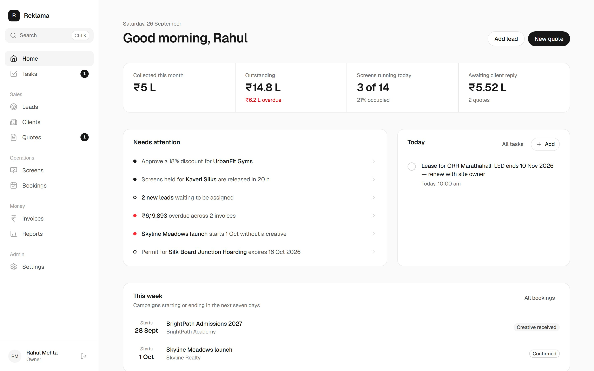
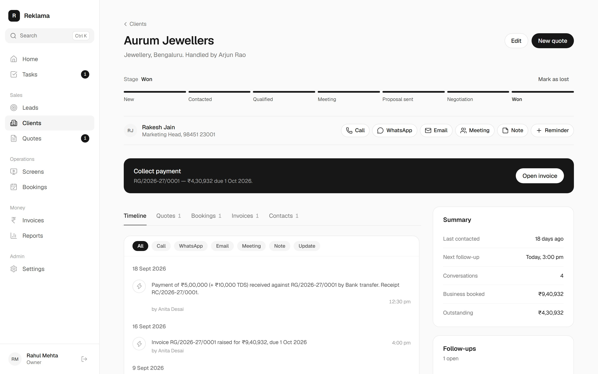
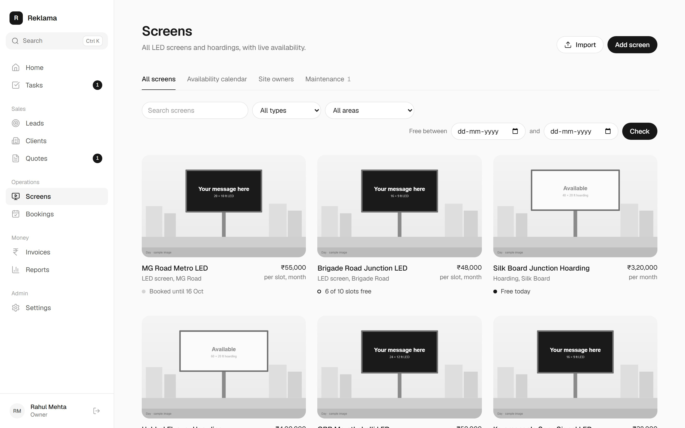
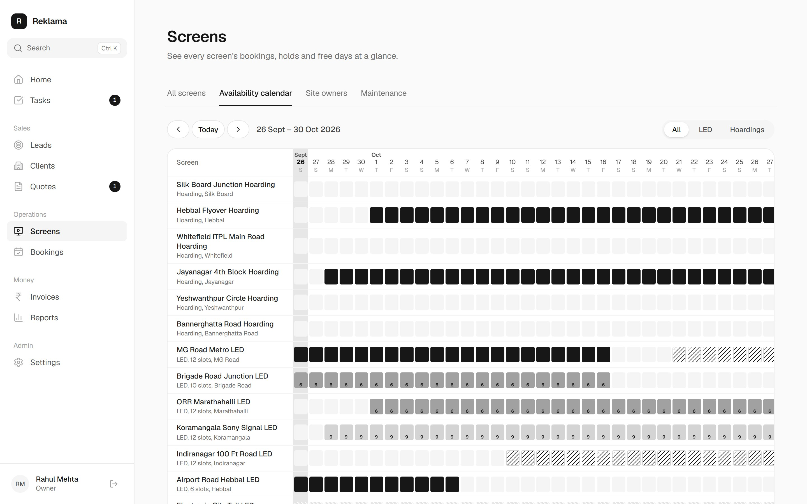
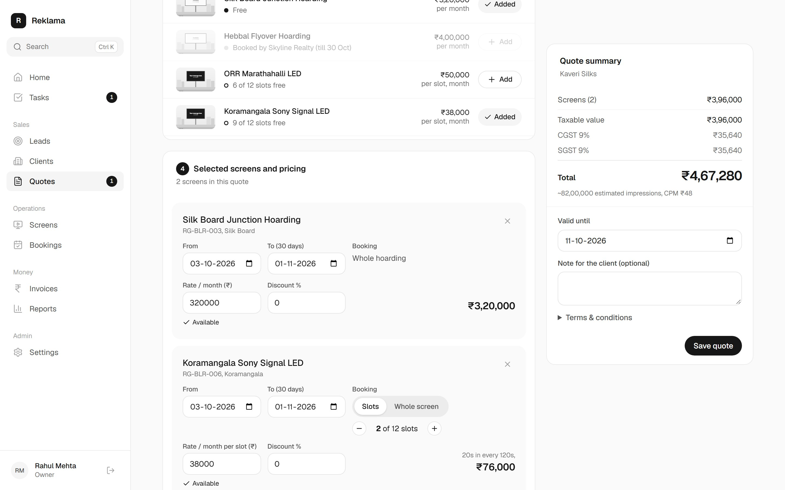
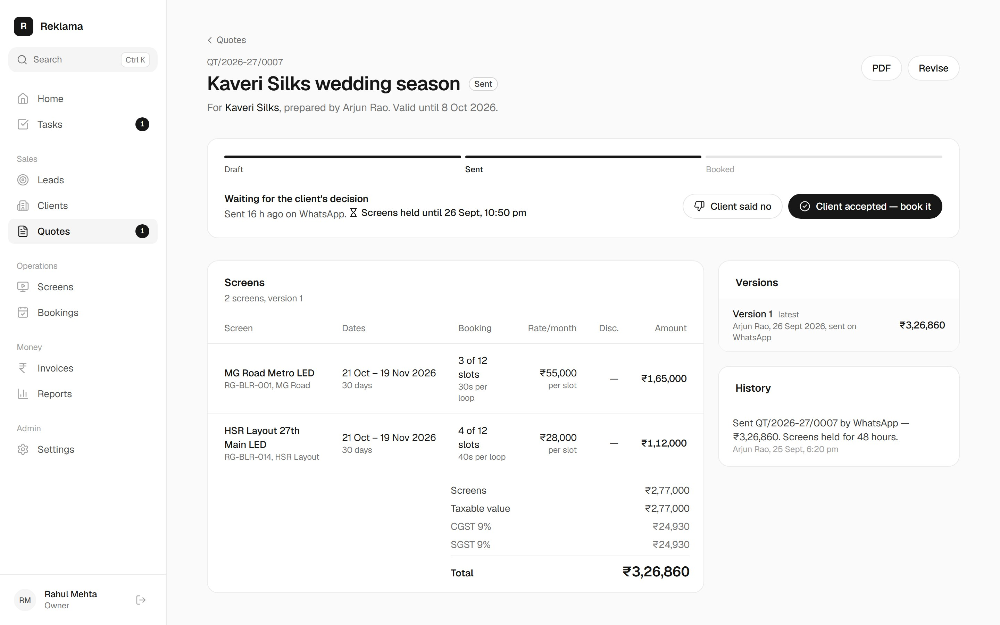
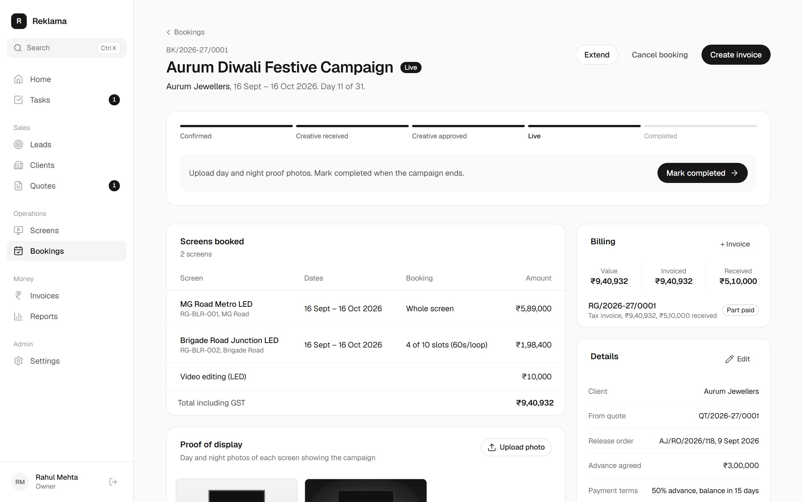
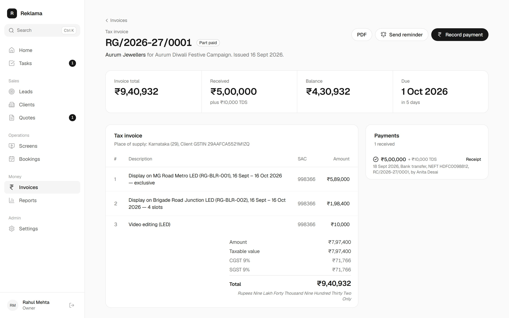
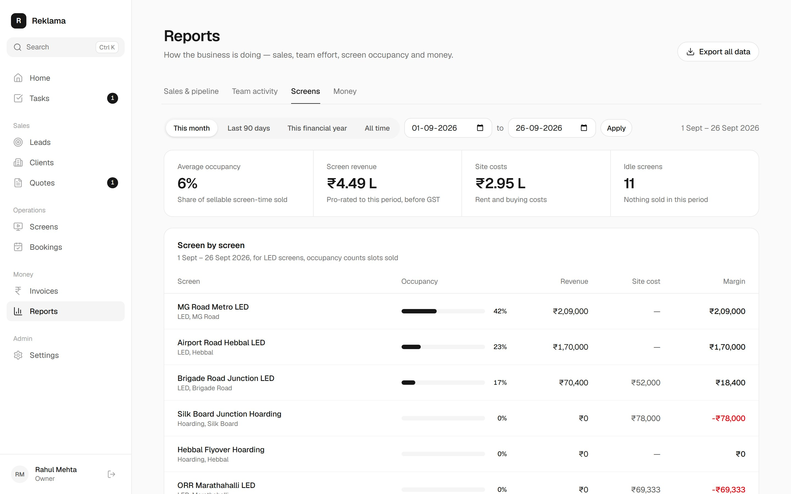

# Reklama

Reklama runs Reklama Global's hoardings and LED screens in one place, from the first call with a brand to the last rupee collected.

**[Open the live demo](https://reklama-crm-sandy.vercel.app)** and pick any person on the sign-in page.

---

## Why it exists

Outdoor media is usually sold across three separate tools:

- a spreadsheet of sites,
- a phone full of WhatsApp threads,
- a separate billing package.

That split causes real problems. The same screen gets promised to two brands. A follow-up is forgotten because it lived in one person's head. Nobody can say what is owed until someone reconciles the accounts.

Reklama replaces all three with one system:

- Every conversation lands on the client's timeline.
- Every screen knows which days and slots are free.
- A quote becomes a booking, and a booking becomes a GST invoice, without anything being typed twice.

## Try it

The demo holds realistic sample data: 14 screens across Bengaluru, 17 clients at every stage of the sales pipeline, live and upcoming campaigns, and invoices at every stage of payment. Dates move with the calendar, so it always looks current.

| Sign in as | Role | What they see |
|---|---|---|
| Rahul Mehta | Owner | Everything, including approvals, settings and every report |
| Priya Sharma | Sales manager | The whole pipeline, team activity, discount approvals up to 20% |
| Arjun Rao, Sneha Iyer | Sales executives | Their own leads, conversations, reminders and quotes |
| Vikram Singh | Operations | Screens, bookings, creatives, proof of display, maintenance |
| Anita Desai | Accounts | Invoices, payments, receipts and what is outstanding |

Every demo account uses the password `demo123`. The Owner can restore the original data from Settings, then Data & backup.

---

## What you can do

### See what needs you today

The home screen is different for each role. It answers one question: what needs attention right now?

- A discount waiting for approval.
- Screens on hold for a client that are about to be released.
- A campaign starting without its creative.
- A permit about to expire.
- Money that is overdue.

Below that are the four figures that matter for the role and the day's tasks. Press Ctrl K (or ⌘K) anywhere to search or jump to any page.

### Keep every client conversation in one place

- **One timeline.** Each client has a single timeline of calls, WhatsApp messages, emails, meetings, notes, quotes, bookings, invoices and payments, whoever on the team recorded them.
- **One-tap logging.** Tapping Call, WhatsApp or Email opens the dialler, the chat or a new message. The conversation is then logged with its outcome and, if needed, a reminder to follow up.
- **Stage track.** A slim bar shows where the deal stands; tap a stage to move it. A lost deal asks why, so patterns show up in the reports.
- **Suggested next step.** The page always suggests one: make first contact, send the quote, collect the payment.
- **Pipeline board.** Leads sit on a board you can drag between stages. They can be imported from Excel, and duplicates are caught by name, phone, email or GSTIN.

### Sell screens by the slot or the whole screen

- **Two ways to sell LED screens.** Each screen can be sold by the slot (a share of the ad loop), as the whole screen, or both. Hoardings are always sold whole.
- **Find free inventory.** Pick campaign dates to see instantly which screens have space.
- **Screen details.** Each screen has day and night photos, a 60-day availability strip, current and upcoming bookings, and this month's revenue against site rent.
- **Behind the scenes.** Site owners, lease end dates, permits and maintenance tickets live with each screen, and expiring permits raise alerts before they become a problem.

The availability calendar shows every screen for five weeks at once:

- free days,
- slots partly sold,
- fully booked days,
- screens on hold while a client decides,
- screens under maintenance.

### Build a quote in minutes

- **Guided steps.** Choose the client and campaign dates, then add screens from a list that shows their availability for those dates.
- **Per-screen choices.** For each screen, choose slots or the whole screen, adjust dates, rates and discounts, and add printing, mounting or design charges.
- **Live totals.** Totals update as you type:
  - agency commission for agency clients;
  - CGST and SGST, or IGST for clients in another state;
  - estimated impressions and cost per thousand views.
- **Approvals.** Discounts above a person's limit go to their manager for approval before the quote can be sent.
- **Sending.** Sending a quote holds the screens for 48 hours, schedules a follow-up, and opens WhatsApp or email with the message already written.
- **Versions.** Every revision is kept as a new version.
- **PDF.** Each quote has a clean PDF with site photos.

### Never double-book a screen

When the client agrees, one action turns the quote into a booking:

- **Capacity check.** Capacity is checked again at that moment, so the same screen and dates can never be sold twice.
- **Released holds.** Other clients' holds that no longer fit are released, and whoever made those quotes is told.
- **Campaign progress.** The campaign moves through clear steps: creative received, creative approved, live, completed.
- **Documents.** The release order, creatives and day and night proof-of-display photos are stored with the booking.
- **Changes.** Bookings can be extended, with availability re-checked, or cancelled.

### Bill the way Indian GST expects

- **Invoice types.** Tax invoices and proforma invoices for advances are created straight from a booking.
- **Numbering.** Numbers run without gaps within each financial year.
- **GST.** CGST and SGST are split within the state and IGST applies across states, with the SAC code and place of supply printed.
- **Agency commission** is shown on the invoice.
- **Payments.** When recording a payment, one tap accounts for the TDS the client deducted.
- **Receipts** are generated for every payment.
- **Collections.** Outstanding amounts are shown by age, with reminders ready to send.
- **Export.** Invoices and payments export to Excel for the accountant.

### See how the business is doing

- **Sales:** the pipeline, where leads come from, why deals are lost, and sales by person.
- **Team:** calls, messages and meetings logged per person.
- **Screens:** occupancy, revenue and margin for every screen.
- **Money:** collections by month and who owes what.
- **Export:** everything, including a complete export of all data.

### Built for a team

- **Five roles.** Owner, sales manager, sales executive, operations and accounts, each seeing what they need.
- **Discount limits** by role, with approvals.
- **Audit log** of who created, changed, approved or cancelled what.
- **Reminders the system raises by itself:**
  - quote follow-ups,
  - holds about to expire,
  - campaigns ending (renewal),
  - overdue invoices,
  - permit and lease renewals.
- **Works on a phone** as well as a desktop.

---

## How a campaign moves through Reklama

1. A lead is added or imported and assigned to a salesperson.
2. Calls, messages and meetings are logged on the lead's timeline, with reminders to follow up.
3. A quote is built from screens that are free for the client's dates.
4. The quote is approved if needed, then sent, and the screens are held.
5. The client agrees, and the quote becomes a booking that reserves the screens.
6. Operations collects the creative, takes the campaign live and uploads proof of display.
7. Accounts raises the invoice and records payments, including TDS.
8. Before the campaign ends, a renewal reminder appears.

## Design principles

- **One clear next step.** Every page makes the obvious action obvious.
- **Quiet by default.** Black, white and greys; red appears only when something needs fixing.
- **Fewer fields.** Only what is needed is asked for up front; everything else sits under "More details".
- **Fast to move around.** Press Ctrl K or ⌘K to search or jump to any page from anywhere.

---

## Status

This is a working prototype built for Reklama Global to evaluate.

**Not built yet:**
- WhatsApp Business, telephony and email integrations that send and capture messages automatically
- A client portal
- Tally or Zoho sync and e-invoicing
- Field-crew photo capture
- Map-based planning, which is deferred

**Hosting.** The demo runs on Vercel and a Turso database. This setup is for the prototype only. Production will be scaled up: hosting in India, a managed database with backups, file storage and monitoring.

- [PRODUCTION_READINESS.md](PRODUCTION_READINESS.md): what is left to build and what go-live requires.
- [PLAN.md](PLAN.md): the full product plan.
- [docs/DEVELOPMENT.md](docs/DEVELOPMENT.md): how to run and change the code.
